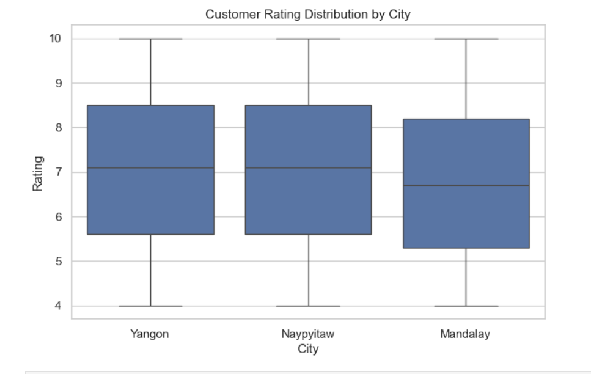
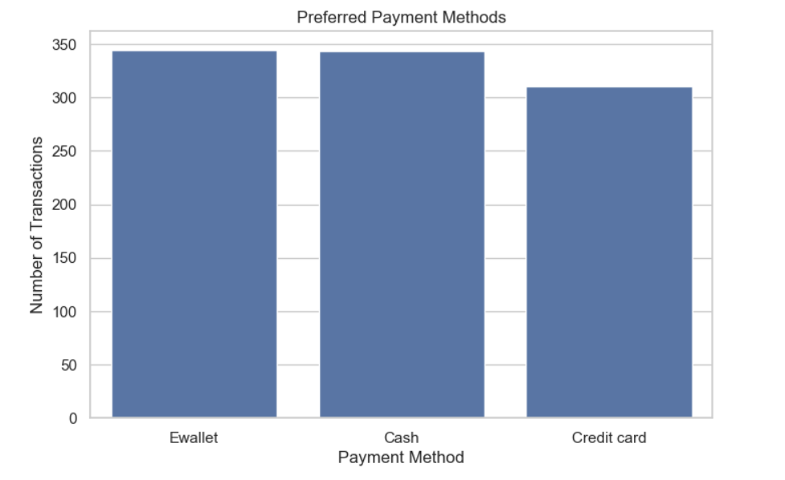
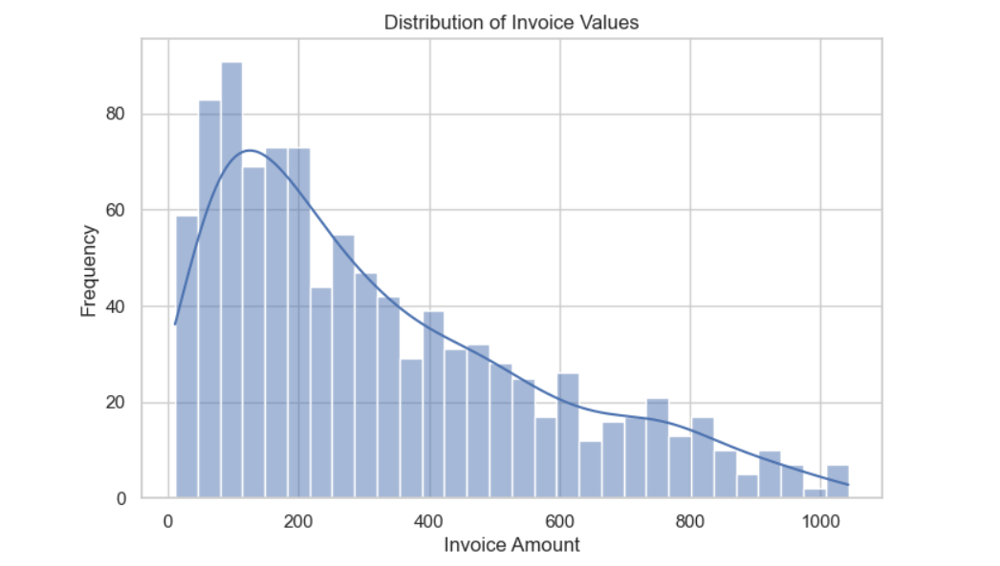
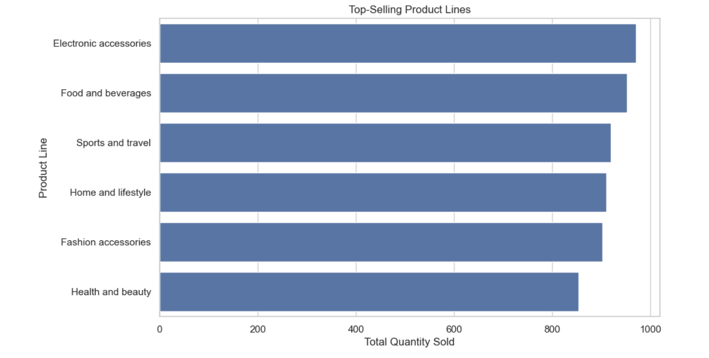
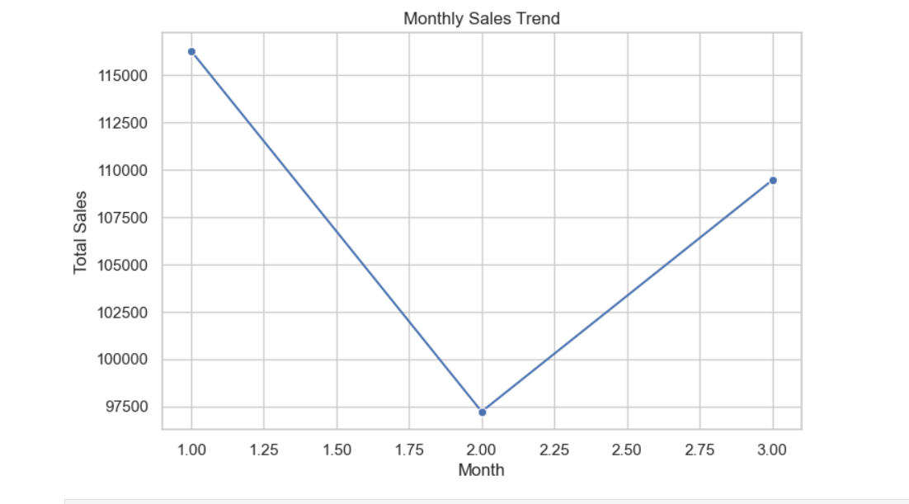
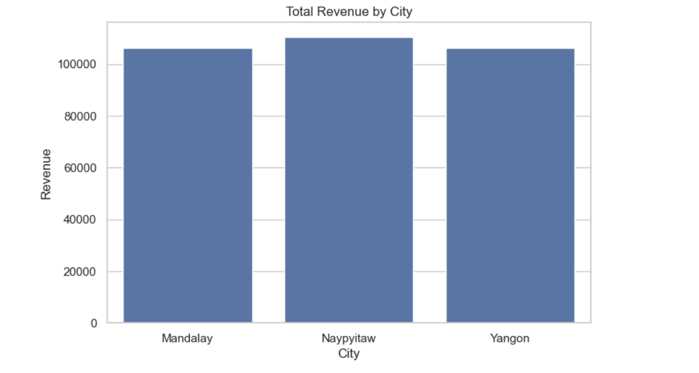

# Amazon Sales Data Analysis 📊

## 📌 Project Overview
This project analyzes Amazon sales data to uncover insights related to customer behavior, sales trends, product performance, and revenue distribution using **Python, SQL, and Data Visualization techniques**.

---

## 🛠 Tools & Technologies
- Python (Pandas, NumPy, Matplotlib, Seaborn)
- SQL (Joins, Aggregations, Window Functions)
- Jupyter Notebook
- Data Visualization
- Git & GitHub

---

## 📂 Dataset Details
- Total Columns: 17+
- Cities: Yangon, Mandalay, Naypyitaw
- Key Features:
  - Product Line
  - Customer Type
  - Payment Method
  - Invoice Amount
  - Rating
  - Revenue

---

## 🔍 Key Analysis Performed
- Customer rating distribution by city
- Preferred payment methods analysis
- Invoice value distribution
- Top-selling product categories
- Monthly sales trend analysis
- Total revenue comparison by city
- SQL-based business insights

---

## 📊 Visual Insights

---

## 🧠 Business Insights
- E-wallet is the most preferred payment method
- Electronic accessories generate the highest sales volume
- Naypyitaw contributes the highest total revenue
- Sales peak during Month 1 with a dip in Month 2

---

## 📁 SQL Analysis
SQL queries used for business insights are available in:

